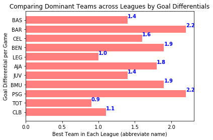
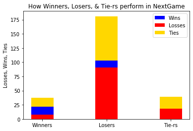
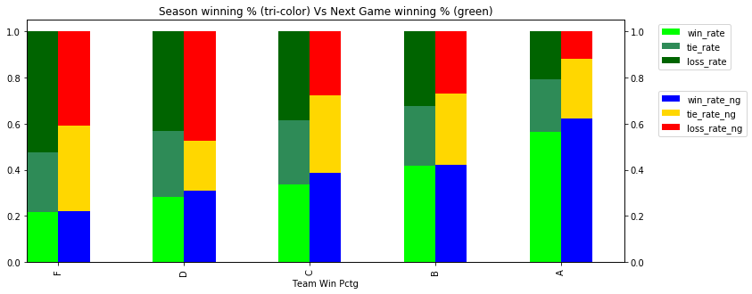

#### Part of a 2-person team that took a SQLLite file on teams in 11 European Soccer Leagues from Kaggle to answer the question, "How does a team do in the next game after playing the league's dominant team?"  We focused on 6,652 matches in the 2015-2016 season.  We used Python to create a dataframe in which we could see two consecutive matches for every team in a single row, identify when the team played the league's best team, and then see what happened in the next game.  Out of the 6,652 total matches, 332 involved the dominant team.

#### Conclusion: Teams did slightly better than their odds would have predicted in the Next Game.  Maybe "upping their game" against the Dominant Team kept the habit going in the next game.  No letdown!

[Slide Deck](https://shaleshk.github.io/OpenWeatherAPI-website/Home.html)

